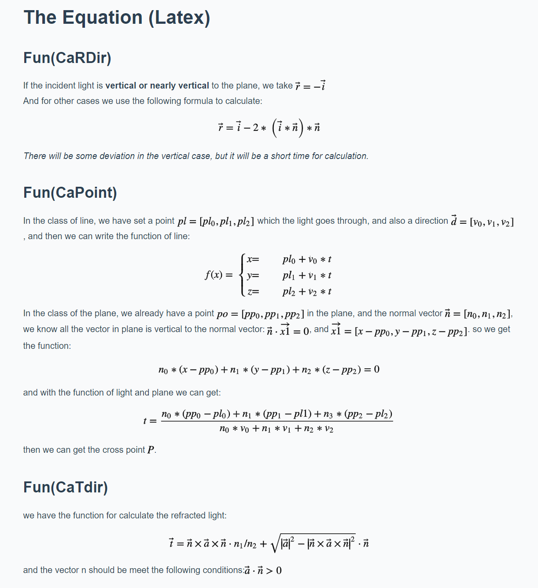

# Progress Documentation

@(Documentation)[Python|Ray tracing]

In most cases of physics, when light hits a boundry of two light-transmittble medium. Both reflection and refraction will occur, the direction is determined by Reflection Law and Snell's Law. In this task, the process of light transmission is being simulated using python. The direction of reflected&transmitted light is calculated using Snell's Law.The whole transmission process is being illustrated. The polarisation and the amplitude of light is not being considered in this task, only the direction. 

-------------------

## Illustration of light transmission


> (illustration of light transmission)fig1.1 (comment of all the angles and medium Index)

### The Law of reflection
As shown in the fig1.1. The angle of reflection is the same as the angle of incident light.

### The Snell's Law
The relationship of the values between two angles is as follows:

$$  n_1 \cdot \sin \theta _1 = n_2 \cdot \sin \theta _2 $$  


In some cases, when light travels from a medium with a higher refractive index to one with a lower refractive index, the angle of the transmitted light could be 90 degree. In optical physics, the energy of transmission will be zero and only reflection will exsit. This phenomenon is named "Total Reflection". The critical angle is determined as follows:

$$ \theta  = \sin ^{-1}\left ( \frac{n_2}{n_1}\right ) $$

## Simulation 
### 1.Tools
Operating System: Win10

Developing environment: Python 3.8, VScode, JupyterNotebook
### 2.Light & Incident surface initialization
Define the light with a point as the starting point and a vector as direction vector:
``` python
#'The class of light'
class Light(object):
    #'p-Place, d-Direction, NormD-Normalized Direction'
    pl = [0,0,0]
    d = np.array([0,0,0])
    dn = np.array([0,0,0])

    #'set the light verctor'
    def inc(self,place,direction):
        self.pl = place
        self.d = direction
        self.dn = Normalized(direction)

    #'Display the place and direction of the light'
    def displayLight(self):
        print('Display the place and direction of the light: ')
        print('Place:{}, Direction:{}'.format(self.pl,self.dn))
```
Define the surface with a point on it and its normal vector:
``` python
#'The class of Object plane'
class Plane(object):
    #'po-The palce of the point in plane, n-the normal verctor of the plane'
    po = [0,0,0]
    n = np.array([0,1,0])
    nn = np.array([0,1,0])

    #'set the Plane with point and normal verctor'
    def inc(self,point,Normal):
        self.po = point
        self.n = Normal
        self.nn = Normalized(Normal)

    #'display the plane with point/normal verctor and the Equation'
    def displayObjectPlane(self):
        print('display the plane with point/normal verctor')
        print('point:{}, Normal:{}'.format(self.po,self.nn))
        print('display the Equation')
        print('{}(x-{})+{}(y-{})+{}(z-{}) = 0'.format(self.n[0],self.po[0],self.n[1],self.po[1],self.n[2],self.po[2],))
```
### 3.Set medium Index of two sides

### 4.Calculate the intersection point of incident light and the surface

 
#### Special cases:
(1) the incident light is parallel to the plane

| Item      |    point  | vector  |
| :-------- | --------: | :--:    |
| Incident light| [1,2,-3]  | [2,1,2]   |
| Plane         | [0,0,0]   | [-1,4,-1] |
| n1 ; n2       |    1      |     1     |


(2) the direction vector of light is vertical to the plane

| Item      |    point  | vector  |
| :-------- | --------: | :--:    |
| Incident light| [1,2,-3]  | [2,1,2]   |
| Plane         | [0,0,0]   | [2,1,2]   |
| n1 ; n2       |    1      |     1     |


//(3) the starting point of light is on the plane
### 5.Calculate the reflection light

#### Special cases:

Total reflection (Case 8)
| Item      |    point  | vector  |
| :-------- | --------: | :--:    |
| Incident light| [1,2,-3]  | [2,1,4]   |
| Plane         | [0,0,0]   | [2,4,3]   |
| n1 ; n2       |    9      |     1     |


### 6.Calculate the transmitted light
> formular and fig

(1) the incident angle is zero(vertical)
> fig and illu.

(2) the incident angle is close to zero
> fig and illu.


## The Python Code Introduction
Because there have set many python file, and the functions many seems not too clearly. So here is a list for the Class, Function. Therefore it will be easy to check the code. 

**Class**
- **Light** 
 - **One point in Light**
--**The direction vector**
--**The normalized direction vector**
- **Plane**
--**One point in Plane**
--**The normal vector**
--**The normalized normal vector**

**Function**
- **Normalized**: put in the vector [x,y,z] and normalize it
- **JudgeCrossPoint**: Determine if there will be a cross point between the Incidentlight and the plane or not
- **JudgeTotalReflection**: Determine if total reflection will occur
- **CaRDir**: calculate the direction of the reflected light.
- **CaPoint**: calculate the point -Intersection of light and plane
- **CaTdir**: calculate the direction of the transmitted light
- **DisplayWholeProcess**: Plot the normalized light and plane
- **InputLightPlane*N**: the test case for the default input, here we have 7 different cases(N = 7)
- **AutoCheckTest**: "The optical path is reversible", then we use that to test the correctness of the program.


## The Equation (Latex)


